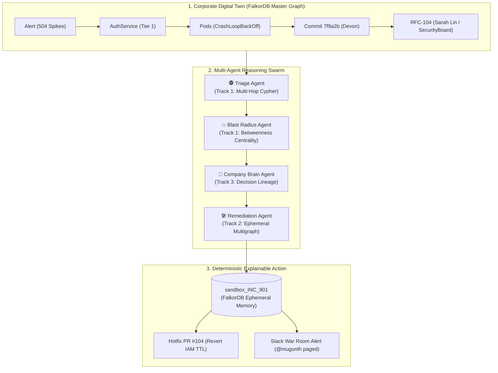

# 🛡️ AEGIS-GRAPH: Autonomous Cloud Blast-Radius & Self-Healing Incident Mesh
> **Powered by FalkorDB** &bull; *Grand Prize Submission for "Graph Hacks: Context for AI Agents"*

[](https://falkordb.com)
[](https://nextjs.org)
[](https://fastapi.tiangolo.com)
[](https://modelcontextprotocol.io)

---

## 🌟 Executive Summary

Modern cloud architectures have outgrown human working memory. During an enterprise Sev-1 outage, thousands of cascading alerts flood SRE teams. Traditional vector-based RAG completely fails because **vector embeddings cannot calculate multi-hop causality, network reachability, or IAM permission chains**.

**`AEGIS-GRAPH`** transforms **FalkorDB** into an active cognitive substrate for a multi-agent swarm. When an alert strikes, the agents traverse the enterprise graph in sub-milliseconds, pinpoint the breaking commit 4 hops away, compute the systemic blast radius using GraphBLAS algorithms, rehearse the fix inside an isolated ephemeral FalkorDB multigraph, and open an automated hotfix Pull Request.

---

## 🎯 How AEGIS-GRAPH Conquers All 3 Hackathon Tracks



### 🕵️ Track 1: Agents That Act on Connected Data
- **Multi-Hop Traversal:** Navigates `(:Alert) -> (:Service) -> (:Pod) -> (:Commit) -> (:Engineer) -> (:Decision)`.
- **Graph Algorithms as Tools:** Native **Betweenness Centrality** calculates that `AuthService` has a critical choke score of `0.42`, holding up 4 downstream Tier-1 microservices.
- **Shortest Path Analysis:** Evaluates exact failure propagation vectors.

### 🤖 Track 2: Agent Memory and Coordination
- **Tri-Layer Cognitive Memory:**
  - *Episodic:* Incident history & chronological agent logs.
  - *Semantic:* Infrastructure digital twin.
  - *Procedural:* Dynamic self-healing runbook DAGs stored directly in FalkorDB.
- **Ephemeral Multigraph Sandboxing:** The agent clones `master_corp_graph` into an ephemeral graph (`sandbox_INC-2026-901_3f4a9b`), rehearses the commit rollback, verifies zero circular deadlocks, and commits the procedure to procedural memory.

### 🧠 Track 3: Company Brain
- **Decision Lineage:** Discovers that commit `7f9a2b` was not a random bug, but was committed to enforce **RFC-104: Zero-Trust IAM Policy** approved by `Sarah Lin` and the `SecurityBoard`.
- **Who Knows What:** Automatically identifies that `Mugunth` (Staff SRE) is on-call, `Sarah Lin` is the architect, and pages both in `#core-platform-outage`.

---

## ⚡ Quickstart

### 1. Launch FalkorDB (via Docker)
```bash
docker compose up -d
```
- **Port 6379:** FalkorDB Redis Graph Protocol
- **Port 3000:** FalkorDB Interactive Browser

### 2. Run the Backend API & Swarm Engine
```bash
cd backend
python -m uvicorn app.main:app --host 0.0.0.0 --port 8000
```
- Health Check: `http://localhost:8000/api/health`
- Topology API: `http://localhost:8000/api/graph/topology`
- Centrality Choke Points: `http://localhost:8000/api/graph/centrality`
- Live SSE Reasoning Stream: `http://localhost:8000/api/incident/stream`

### 3. Launch Aceternity-Styled Frontend
```bash
cd frontend
npm run start
```
Open **[http://localhost:3000](http://localhost:3000)** in your browser.

---

## 🛠️ Model Context Protocol (MCP) Tools

The FalkorDB MCP Server exposes standard endpoints for Claude, Gemini, and OpenAI:
- `falkor_query_cypher`: Run arbitrary openCypher traversals.
- `falkor_compute_blast_radius`: Calculate downstream dependency degradation.
- `falkor_find_shortest_path`: Deterministic causal link discovery.
- `falkor_clone_sandbox_graph`: High-speed ephemeral multigraph isolation.

---

## 💎 Design System & Stack
- **Typography:** Inter Font family (`next/font/google`).
- **Styling:** Aceternity UI inspired Dark Mode (`#030712`), SVG Spotlight effect, dot/grid radial mask, glowing bento cards.
- **Visualizer:** Force-directed Canvas engine with real-time particle pulses along active causal failure paths.
